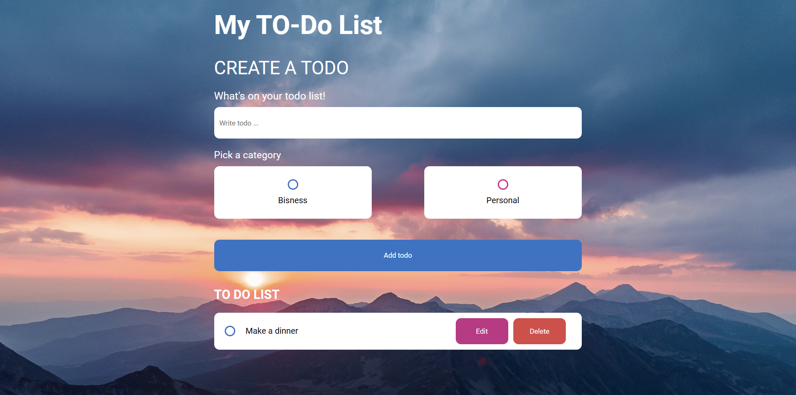
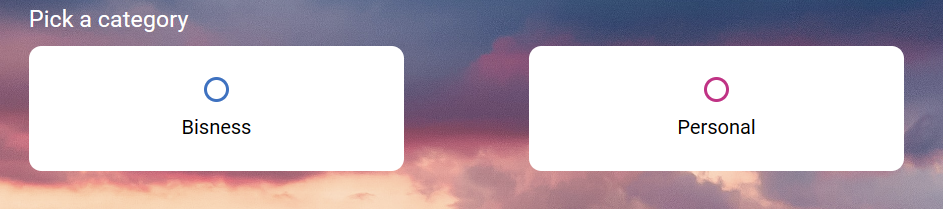
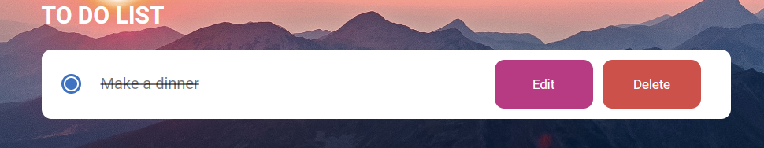

# neobis-todo-list
TO_DO LIST
Этот проект представляет собой , To-Do List .
Который позволит Вам , работать с планированием своих задач, делить их на категрии "рабочие" и "личные ". Отмечать выполненный задачи

Как пользоваться .
Основное поле для работы , это форма ввода :

В поле ввода, вевести задачу :

Выбрать тип задачи , по умолчанию стоит тип "личные" :

Задачу можно пометить как выполненную:

Редактирование задачи производиться путем нажатия на кнопку "Edit"
Удаление при помощи кнопки "Delete

Как установить :
Скопировать ssh ключ
Вставить в командру строку и склонировать проект при помощи команды : git clone
Открыть проект в редакторе кода
Скопировать локальный путь и вставить в браузер
